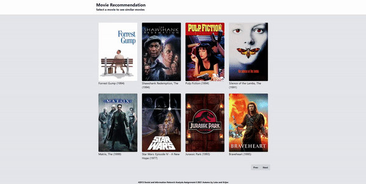

<p align="center">
  <h3 align="center">Movie Recommendation</h3>
  <p align="center">
    Website to recommend similar movies to popular movies from MovieLens 100k dataset.
  </p>
</p>

<!-- ABOUT THE PROJECT -->
## About The Project


Simple website that utilises a recommendation system based on the content-based filtering method. The system has been trained on the MovieLens 100k dataset. The website shows the most popular movies from the dataset and will provide a range of similar movie selections for each movie. 

### Built With

* [React](https://reactjs.org/)
* [Tailwind](https://tailwindui.com/)
* [Python](https://www.python.org/)
* [FastAPI](https://fastapi.tiangolo.com/)
* [Pandas](https://pandas.pydata.org/)

<!-- GETTING STARTED -->
## Getting Started

To get a local copy up and running follow these simple steps.

### Prerequisites
You can run the project using Docker or without docker.
#### The prerequisities for Docker are:
* Docker
    * Download latest from Docker website
#### The prerequisities without Docker are:
* Node.js
    * Download latest from Node.js website
* Python 3.9
    * Download latest 3.9 version from Python website
* TheMovieDB API key
    * Need to create an account on TheMovieDB and create an API key

### Installation
1. Clone the repo
   ```sh
   git clone https://github.com/lukekoko/Movie-Recommendation
   ```
2. Create `.env` file in root directory of `Frontend` folder.
3. Enter TheMovieDB API key in `.env` file
    ```sh
   REACT_APP_MOVIEDB_API='ENTER YOUR API'
   ```
#### Docker
4. Ensure docker is installed. Run:
   ```sh
   Docker compose build
   ```
5. Run:
   ```sh
   Docker compose up
   ```
Install done. Can move to __Usage__ section
#### Without Docker

4. cd into __Frontend__ folder 
    ```sh
    cd Frontend
    ```
5. Install npm packages
    ```sh
    npm install
    ```
6. Start React project
    ```sh
    npm start
    ```
7. Open another terminal/cmd

8. cd into __backend__ folder
    ```sh
    cd Backend
    ```
9. Install virtualenv 
    ```sh
    pip install virtualenv
    ```
10. Create virtual environment 
    ```sh
    python -m venv venv
    ```
11. Activate virtual environment
    ```sh
    Windows: venv\Scripts\activate
    Linux: /venv/bin/activate
    ```
12. Install Python packages
    ```sh
    pip install -r requirements.txt
    ```
13. Start backend project
    ```sh
    uvicorn main:app --reload
    ```
## Usage

Once the installation steps are done, the website can be accessed at `http://localhost:3000/`
